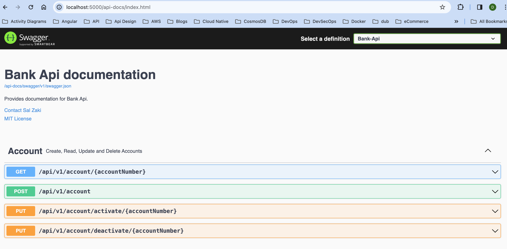

## API Documentation
After successfully launching the application either locally or as a Docker container, you can access the API documentation by navigating to the following URL in your web browser:

``` console
http://localhost:5000/api-docs/index.html
```



This URL will provide you with comprehensive documentation for interacting with the API, including details on available endpoints, request parameters, response formats, and more.

Additionally, you can make API requests directly from the command line using cURL. Here's an example command to get started,

``` console
curl -X GET http://localhost:5000/api/v1/accounts/1234
```

### Account Endpoint - Manage Bank Accounts

#### Create Account


##### Endpoint `/v1/account`

##### Description This endpoint allows the creation of a new bank account.

##### Body parameters

| Parameter Name       | Type   | Mandatory | Validation                                | Description                              |
|:---------------------|:-------|:----------|:------------------------------------------|:-----------------------------------------| 
| account_id           | string | No        | Max length: 100 characters                | Unique identifier for the account        |
| account_number       | string | No        | Max length: 100 characters                | Account number                           |
| account_holder_name  | string | Yes       | Max length: 50 characters                 | Name of the account holder               |
| account_balance      | string | No        | >=0                                       | Initial account balance                  |
| account_type         | string | No        |                                           | "0" for Current, "1" for Savings Account |
| sort_code            | int    | No        | Max length: 6, Greater than or equal to 0 | UK bank sort code                        |
| iban                 | string | No        |                                           | International Bank Account Number (IBAN) |

Note:
- Mandatory fields are indicated by "Yes" under the Mandatory column.
- "account_type" should be set to "0" for Current Account or "1" for Savings Account.

##### Response Body

``` json
{
  "account_id": "123456"
}
```

##### Response Header

``` console
access-control-allow-methods: PUT,GET,HEAD,POST,DELETE,OPTIONS
access-control-allow-origin: http://localhost:5000
api-supported-versions: 1.0
content-type: application/json; charset=utf-8
location: api/v1/account/123456
```

##### Response Status Codes

| Status Code | Description                             | Example Response Body                                                                                                                                                                                                                                                                                         |
|-------------|-----------------------------------------|---------------------------------------------------------------------------------------------------------------------------------------------------------------------------------------------------------------------------------------------------------------------------------------------------------------|
| 201         | Created                                 | `{ "account_id": "1234567890 }"`                                                                                                                                                                                                                                                                              |
| 400         | Bad Request                             | `{ "type": "https://httpstatuses.io/400", "title": "Validation Error", "detail": "Bank Api validation has failed, due to following error(s)", errors": [ { "name": "account_number", "message": "Account number can not be zero or negative" }], "documentation_url": "api/v1/documentation/account/20001" }` |
| 500         | Internal Server Error                   | `{ "error": "An unexpected server error occurred." }`                                                                                                                                                                                                                                                         |

