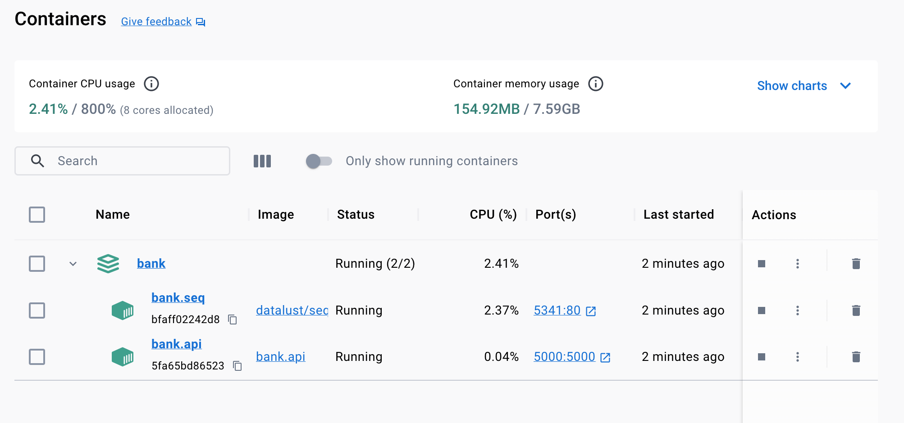
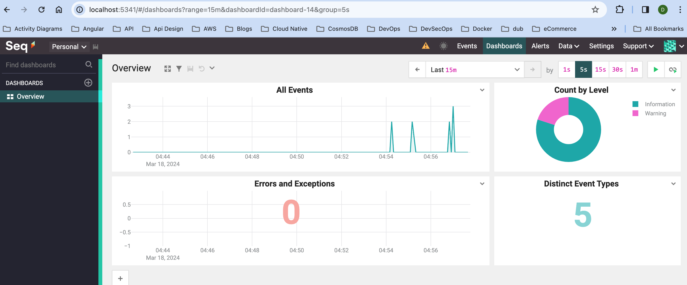
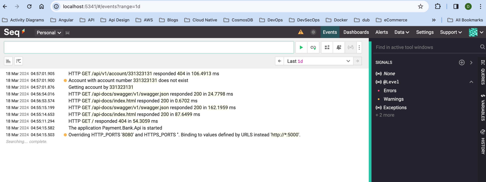

<a href="https://twitter.com/intent/follow?screen_name=sal_zaki"></a>
<a href="https://www.linkedin.com/in/sal-zaki-b39369172" rel="nofollow"></a>
[](http://commitizen.github.io/cz-cli/)

# Bank Microservice
This microservice provides banking functionalities through a clean architecture approach, utilizing Domain-Driven Design (DDD) principles, built using the latest version of .NET Core i.e. `.NET 8.0`

## Features
- Create new bank accounts
- Retrieve existing bank accounts
- Activate existing bank accounts
- Deactivate existing bank accounts

## Technologies Used
<a href="https://dotnet.microsoft.com/"></a>
<a href="https://hub.docker.com/"></a>
<a href="https://datalust.co/"></a>

## Solution Structure

````
bank/
│
├── src/
│   ├── Payment.Bank.Api/
│   │   ├── Controllers/
│   │   ├── Extensions/
│   │   ├── Middlewares/
│   │   ├── Options/
│   │   ├── Swagger/
│   │   ├── Program.cs
│   │   ├── appsettings.json
│   │   └── Startup.cs
│   │
│   ├── Payment.Bank.Application/
│   │   └── Accounts/
│   │       ├── Features/
│   │       │   ├── ActivateAccount/
│   │       │   ├── CreateAccount/
│   │       │   ├── DeactivateAccount/
│   │       │   └── GetAccount/
│   │       ├── Repositories/
│   │       └── Services/
│   │
│   ├── Payment.Bank.Common/
│   │   ├── Abstractions/
│   │   ├── Exceptions/
│   │   ├── Extensions/
│   │   ├── Mappers/
│   │   └── Utilities/
│   │
│   ├── Payment.Bank.Domain/
│   │   ├── Entities/
│   │   ├── Exceptions/
│   │   └── ValueObjects/
│   │
│   └── Payment.Bank.Infrastructure/
│       └── Repositories/
│
├── README.md
├── LICENSE
└── .gitignore
````

## Getting Started

### Prerequisites
- .NET Core SDK 8.0
- Docker installed on your machine.

### Installation
Clone the repository:

````shell
git clone https://github.com/salzaki/bank.git
````

Navigate to the project directory:
````shell
cd bank
````

Build the project:
````shell
dotnet build
````

Run the project:
````shell
dotnet run
````

### Build and run using Docker Compose

You can build and run whole application using [docker compose](https://docs.docker.com/compose/) from root folder:

````shell
docker-compose build
````

````shell
docker-compose up
````


### AppSettings

#### Api Settings

``` config
"Api": {
  "Name": "Bank-Api",
  "Version": "1.0",
  "ApiVersionHeader": "x-api-version",
  "ReportApiVersions": true,
  "BaseUrl": "/api",
  "DocumentationUrl": "api/v1/documentation/",
  "BannerEnabled": true,
  "Authorization": {
    "ApiKey": "607F6A23-D130-46CD-A93C-6D9A6E5A8FB2"
  }
}
```

#### Swagger Settings

``` config
"Swagger": {
  "Enabled": true,
  "Name": "Bank-Api",
  "RoutePrefix": "api-docs",
  "RouteTemplate": "/api-docs/swagger/{documentName}/swagger.json",
  "EndpointPath": "/api-docs/swagger/{0}/swagger.json",
  "Info": {
    "Title": "Bank Api documentation",
    "Description": "Provides documentation for Bank Api.",
    "License": {
      "Name": "MIT License",
      "Url": "https://en.wikipedia.org/wiki/MIT_License"
    },
    "Contact": {
      "Name": "Sal Zaki",
      "Email": "salzaki@hotmail.com"
    }
  }
}
```

#### Feature Management Settings

``` config
"FeatureManagement": {
  "CreateAccount": true,
  "GetAccount": true,
  "DeactivateAccount": true,
  "ActivateAccount": true
}
```

## Account Controller with Feature Gate

``` csharp
[HttpGet("{accountNumber:int}", Name = "GetByAccountNumber")]
[FeatureGate(Constants.Features.GetAccount)]
[SwaggerOperation(
    OperationId = nameof(GetByAccountNumberAsync),
    Description = "Gets an account by account number.",
    Tags = ["Account"])]
[SwaggerResponse(StatusCodes.Status200OK, Type = typeof(GetAccountResponse))]
[SwaggerResponse(StatusCodes.Status400BadRequest, Type = typeof(BadRequest<ProblemDetails>))]
[SwaggerResponse(StatusCodes.Status404NotFound, Type = typeof(NotFound))]
[SwaggerResponse(StatusCodes.Status500InternalServerError, Type = typeof(ProblemDetails))]
public async Task<Results<Ok<GetAccountResponse>, BadRequest<ProblemDetails>, NotFound>> GetByAccountNumberAsync(
  [FromServices] IAccountService accountService,
  [Required][FromRoute] int accountNumber,
  CancellationToken cancellationToken = default)
{
  ...
}
```
### Business Policies - Not implemented Yet

```csharp
public void Deposit(decimal amount)
{
  this.CheckPolicy(DepositCannotBeMadeToDeactivatedAccountPolicy);
  this.AccountBalance += amount;
}
```
## [Api Documentation](ApiDocumentation.md)

## Structured Logging





## Roadmap

List of features/tasks/approaches to add:

| Name                        | Status | Release date |
|-----------------------------|--------|--------------|
| Domain Unit Tests           | To do  | TBA          |
| Application Unit Tests      | To do  | TBA          |
| Integration Automated Tests | To do  | TBA          |

## Resources and References

### Seq
- [Seq Documentation](https://docs.datalust.co/docs/an-overview-of-seq)

### Domain-Driven Design

- ["Domain-Driven Design: Tackling Complexity in the Heart of Software"](https://www.amazon.com/Domain-Driven-Design-Tackling-Complexity-Software/dp/0321125215) book, Eric Evans
- ["Implementing Domain-Driven Design"](https://www.amazon.com/Implementing-Domain-Driven-Design-Vaughn-Vernon/dp/0321834577) book, Vaughn Vernon
- ["Domain-Driven Design Distilled"](https://www.amazon.com/dp/0134434420) book, Vaughn Vernon
- ["Patterns, Principles, and Practices of Domain-Driven Design"](https://www.amazon.com/Patterns-Principles-Practices-Domain-Driven-Design-ebook/dp/B00XLYUA0W) book, Scott Millett, Nick Tune

#### Application Architecture

- ["Patterns of Enterprise Application Architecture"](https://martinfowler.com/books/eaa.html) book, Martin Fowler
- ["Dependency Injection Principles, Practices, and Patterns"](https://www.manning.com/books/dependency-injection-principles-practices-patterns) book, Steven van Deursen, Mark Seemann
- ["Clean Architecture: A Craftsman's Guide to Software Structure and Design (Robert C. Martin Series"](https://www.amazon.com/Clean-Architecture-Craftsmans-Software-Structure/dp/0134494164) book, Robert C. Martin
- ["The Clean Architecture"](https://blog.cleancoder.com/uncle-bob/2012/08/13/the-clean-architecture.html) article, Robert C. Martin

## License

- [MIT License](LICENSE)

## Fun Quote

> As you start to walk on the way, the way appears.
>
> **[Rumi](https://en.wikipedia.org/wiki/Rumi)**

